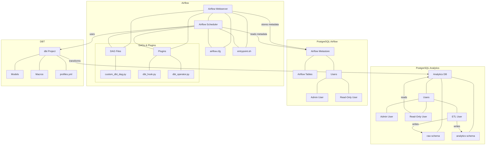

# Data Platform with PostgreSQL, Airflow, and JupyterLab for RobotDreams DE course

Typical DP that utilizes Airflow and Postgresql.

## Architecture

This platform consists of several containerized services:

- **PostgreSQL Analytics Database**: Stores raw and transformed data
- **PostgreSQL Airflow Metastore**: Manages Airflow's operational data
- **Airflow Webserver & Scheduler**: Orchestrates data workflows
- **JupyterLab**: Provides an environment for ML and data analysis
- **dbt**: Handles data transformations

The architecture follows separation of concerns principles, with distinct user roles for admin, read-only, and ETL operations.

## Project Structure

```
data-platform/
├── .env                             # Environment variables for all services
├── docker-compose.yaml              # Main container orchestration file
├── README.md                        # Project documentation
│
├── postgres_analytics/              # Analytics database configuration
│   ├── Dockerfile                   # PostgreSQL image with custom config
│   ├── init.sql                     # Database initialization script
│   └── postgresql.conf              # Database performance tuning
│
├── postgres_airflow/                # Airflow metastore configuration
│   ├── Dockerfile                   # PostgreSQL image with custom config
│   ├── init.sql                     # Metastore initialization script
│   └── postgresql.conf              # Database performance tuning
│
├── airflow/                         # Airflow configuration and code
│   ├── Dockerfile                   # Airflow image with custom dependencies
│   ├── airflow.cfg                  # Airflow configuration file
│   ├── requirements.txt             # Python dependencies
│   ├──dbt/                             # dbt project for transformations
│       ├── profiles.yml                 # dbt connection profiles
│       ├── homework/              # Main dbt project directory
│       │   ├── dbt_project.yml         # Project configuration file
│       │   ├── packages.yml            # Package dependencies
│       │   ├── profiles.yml            # Connection profiles
│       │   ├── seeds/
│       │   │   └── iris_dataset.csv    # The raw Iris dataset
│       │   └── models/
│       │       ├── schema.yml          # Schema definitions
│       │       ├── sources.yml         # Source definitions
│       │       ├── staging/
│       │       │   └── stg_iris.sql    # Staging model for iris data
│       │       └── mart/
│       │            └── iris_processed.sql  # Final processed model with ML
│       └── my_dbt_project/              # Main dbt project directory
│           ├── dbt_project.yml          # Project configuration
│           ├── models/                  # SQL transformation models
│           │   └── example/             # Example models group
│           │       └── my_first_model.sql # Sample transformation
│           └── macros/                  # Reusable SQL macros
│               └── ... (macros)
│   ├── dags/                        # Airflow DAG definitions
│   │   ├── custom_dbt_dag.py        # DAG for dbt operations
│   │   └── ... (other DAGs)
│   ├── plugins/                     # Custom Airflow plugins
│   │   ├── __init__.py              # Plugin registration
│   │   ├── dbt_hook.py              # Custom hook for dbt operations
│   │   └── dbt_operator.py          # Custom operator for dbt tasks
│   └── scripts/
│       └── entrypoint.sh            # Container startup script
│
└── dbt/                             # dbt project for transformations
    ├── profiles.yml                 # dbt connection profiles
    └── my_dbt_project/              # Main dbt project directory
        ├── dbt_project.yml          # Project configuration
        ├── models/                  # SQL transformation models
        │   └── example/             # Example models group
        │       └── my_first_model.sql # Sample transformation
        └── macros/                  # Reusable SQL macros
            └── ... (macros)
```

## Project Architecture



## Setup and Installation

### Prerequisites

- Docker and Docker Compose
- Git

### Installation

1. Clone this repository:
```bash
git clone https://github.com/robot-dreams-code/UA_DATA-ENGINEERING_KHOROSHYKH.git/lecture_07.git
cd data-platform
```

2. Create a `.env` file with required environment variables (see `.env.example`):
```bash
cp .env.example .env
# Edit .env file with your preferred settings
```

3. Build and start the containers:
```bash
docker-compose up -d
```

### Accessing Services

- **JupyterLab**: http://localhost:8888 (token specified in `.env`)
- **Airflow**: http://localhost:8080 (username: admin, password: admin)
- **PostgreSQL Analytics**: localhost:5432
- **PostgreSQL Airflow**: localhost:5433

## User Roles

The platform includes several user types with appropriate permissions:

- **Admin Users**: Full access to respective databases
- **Read-Only Users**: Query-only access for analysis and exploration
- **ETL User**: Write access for data transformations

## Workflow

1. **Data Ingestion**: Raw data is loaded into the PostgreSQL analytics database
2. **Transformation**: Airflow schedules dbt jobs to transform the data
3. **Analysis**: Data scientists use JupyterLab to analyze the transformed data

## Custom dbt Integration

Airflow integrates with dbt through custom operators and hooks:

- The dbt project is mounted into the Airflow containers
- Custom operators execute dbt commands through a Python interface
- Transformations run with the ETL user credentials

## Configuration

### Environment Variables

The `.env` file contains all configuration values including:
- Database credentials
- Service configurations
- Security tokens

### PostgreSQL Configuration

Both PostgreSQL instances are tuned for their specific workloads:
- Analytics database: Optimized for data warehousing queries
- Airflow metastore: Configured for operational workloads

### Airflow Configuration

Airflow is configured via `airflow.cfg` with environment variable substitution.

## Development

### Adding dbt Models

1. Add new SQL models to the `dbt/my_dbt_project/models/` directory
2. Test locally: `cd dbt && dbt run --profiles-dir .`
3. Commit to version control

### Creating Airflow DAGs

1. Add new DAG files to `airflow/dags/`
2. DAGs will be automatically picked up by Airflow

### Adding JupyterLab Notebooks

1. Create notebooks in the JupyterLab interface
2. Notebooks are stored in the `jupyterlab/notebooks/` directory